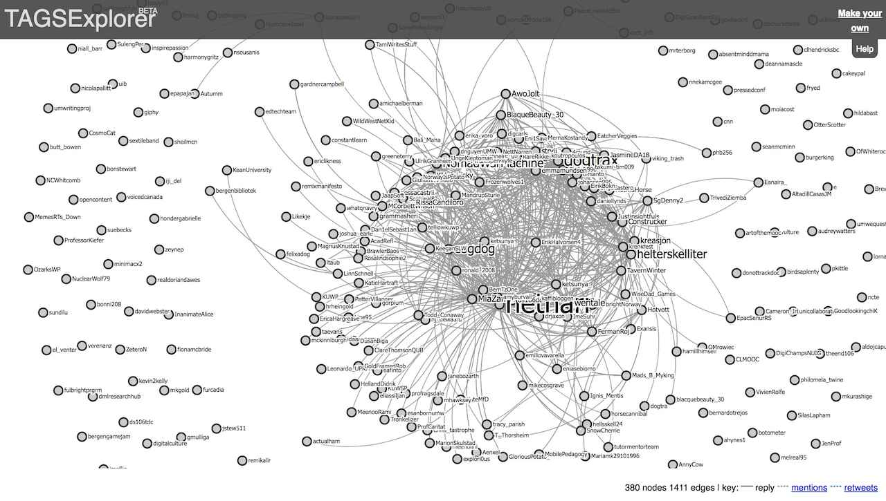
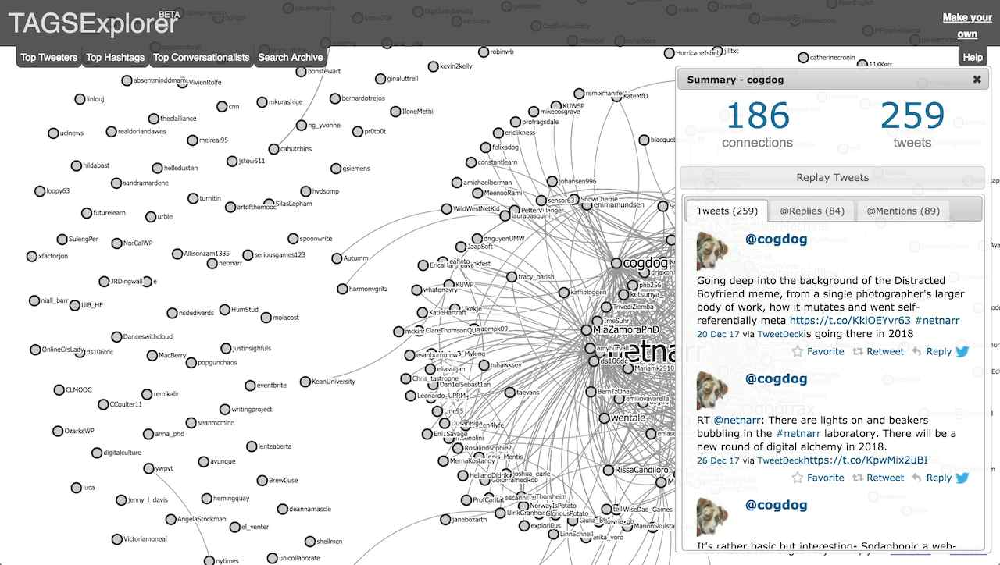

# Wordpress Plugin Find in TAGS Conversation Explorer

made by @cogdog https://cog.dog

-----
*If this kind of stuff has any value to you, please consider supporting me so I can do more!*

 

----- 

This Wordpress plugin provides a shortcode to embed lookup form that allows a lookup of a  name in a Twitter TAGs Conversation Explorer (the [worksheet archive of Twitter activity](https://tags.hawksey.info) created by Martin Hawksey).

For example this is [the visualization of tweets for #netnarr](https://hawksey.info/tagsexplorer/?key=1vEfH0ZKcQ2dZx8f31Pt18tnUCHi5nHKSSPndNHC2YUc&gid=400689247) a course I teach.

There is a lot of nodes in there. Each one provides pop up box with all the data for one person. But it's hard to find a specific one in complex networks like this one.

Martin told me that I could generate a direct link by taking the URL for the Conversation Explorer:

     https://hawksey.info/tagsexplorer/?key=1vEfH0ZKcQ2dZx8f31Pt18tnUCHi5nHKSSPndNHC2YUc&gid=400689247
     
and appending onto it `&name=cogdog` if I wanted to find my own info, or directly

https://hawksey.info/tagsexplorer/?key=1vEfH0ZKcQ2dZx8f31Pt18tnUCHi5nHKSSPndNHC2YUc&gid=400689247&name=cogdog

But who wants to munge together URLs by hand? 

This plugin provides a shortcode that creates a small form field where a user can enter a twitter name and spawn the link to the Conversation Explorer for that user.

## Installing The Plugin 

Download this repo as a .zip file using the **Clone or Download** green button. Then install in your Wordpress Plugins by uploading the zip, and activating the plugin.

## Using the Shortcode

The form can be put in a post, page, or sidebar. Just add to your editor

     [findintags url="https://hawksey.info/tagsexplorer/?key=....."]
     
where `url` is the link from your own Twitter TAGs worksheet.

which renders as the small form in the red box (using default styles of your theme)

Twitter names do not need the @ sign; if present it will be truncated. The Conversation Explorer will open in a new window.

For any CSS styling, the form structure is:

     <form id="findtagsform">
        <label for="twitter">Twitter Name</label> 
        <input type="input" id="tweeter"> 
        <input type="submit" value="Find">
	 </form>

For now the work is done in an `action="javascript:....` on the form field, the lamest way to go about it, but if it needs it down the line, it can be moved to a call to a function in a script tag.

